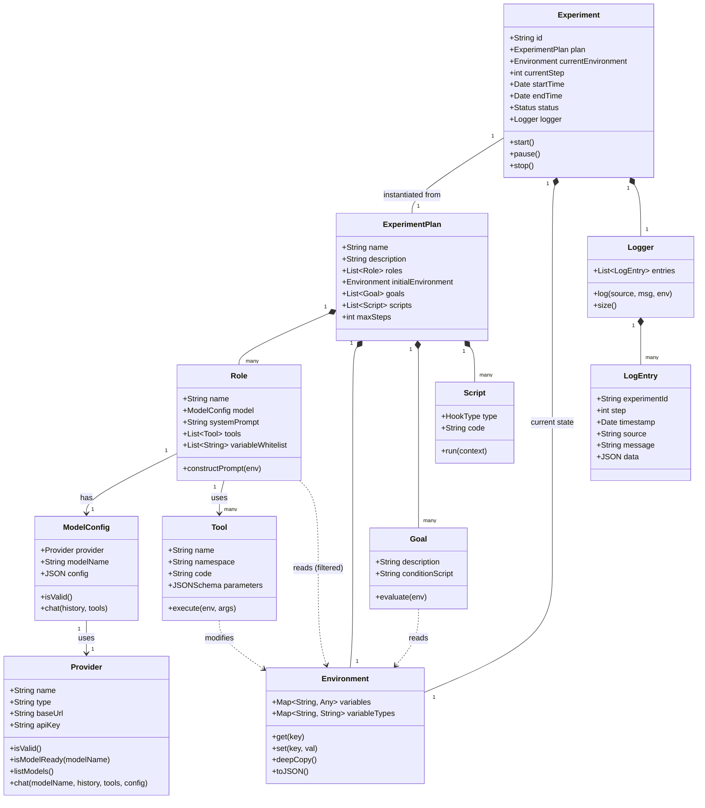
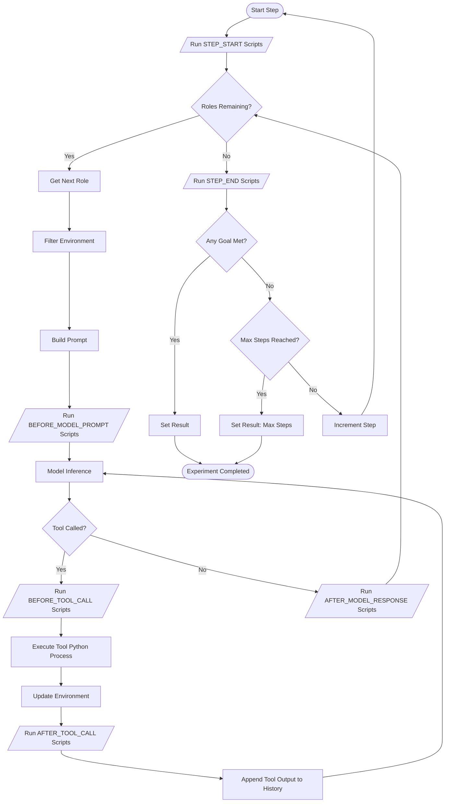

# Project Specification: Scientist.ai

## 1. Architecture Overview

The system uses the MEAN stack (MongoDB, Express, Angular, Node.js) to provide a
robust platform for designing and running agentic AI experiments.

- **Frontend**: Angular application serving as the "Scientist" interface.
- **Backend**: Node.js/Express REST API server.
- **Database**: MongoDB for storing plans, experiments, logs, and object definitions.
- **Execution Engine**: Node.js orchestrator that spawns Python subprocesses for
  executing Tools and Scripts (keeping the core logic close to the AI ML ecosystem).
- **AI Interface**: Module to communicate with LLM providers (initially Ollama).

## 2. Domain Objects & Class Layout

### 2.1 Core Objects

#### **Environment**

- **Purpose**: Holds the state of an experiment step.
- **Members**:
  - `variables`: Map<String, Any> (Values).
  - `variableTypes`: Map<String, String> (Type definitions: `string`, `int`,
    `float`, `bool`, `enum:[A,B]`).
- **Methods**:
  - `deepCopy()`: Returns a new Environment instance with detached state.
  - `toJSON()`: Serializes state for storage or API transmission.
  - `get(key)`: Retrieval.
  - `set(key, value)`: Modification (enforces type safety based on `variableTypes`).

#### **Tool**

- **Purpose**: Action capability for an agent.
- **Members**:
  - `name`: String (Unique within namespace).
  - `namespace`: String.
  - `description`: String (For LLM consumption).
  - `parameters`: JSON Schema definition of accepted arguments.
  - `code`: String (Python source code).
- **Methods**:
  - `execute(environment, arguments)`: Runs the python script, returns output,
    may modify environment.

#### ModelConfig

- **Purpose**: Specifies a Model and its provider and configuration.
- **Members**:
  - `provider`: `Provider`. Backend used to communicate with model.
  - `modelName`: String. Passed to backend to identify which model to inference with.
  - `config`: JSON. Provider- and Model-specific config (e.g., temperature, top_p) which is passed to the Provider as-is.
- **Methods**:
  - `isValid()`: Returns `true` if `provider` can be communicated with and the `modelName` is valid with the `provider`.
  - `chat(history, tools)`: wrapper around `provider.chat`.
    - `history`: List of message objects `{role: string, content: string}`.
    - `tools`: List of tool definitions.
    - Returns: A stream of events/tokens.

#### Provider

- **Purpose**: Interface between this app and backend driver (e.g. Ollama, OpenAI, Anthropic, etc).
- **Members**:
  - `name`: String (e.g., "Ollama Local", "OpenAI").
  - `type`: Enum (OLLAMA, OPENAI, ANTHROPIC, GENERIC_OPENAI).
  - `baseUrl`: String (URL to the API endpoint).
  - `apiKey`: String (Encrypted/Safe storage).
- **Methods**:
  - `isValid()`: Returns `true` if a connection to this Provider can be established successfully.
  - `isModelReady(modelName)`: Returns `true` if the provider reports that a model by this name can be chatted with.
  - `listModels()`: Returns a list of available model names.
  - `chat(modelName, history, tools, config)`: Initiates a chat completion request and returns a stream.

#### **Role**

- **Purpose**: Defines an Agent's identity and capabilities.
- **Members**:
  - `name`: String.
  - `modelConfig`: ModelConfig (Provider, Model Name, Temp, etc.).
  - `systemPrompt`: String.
  - `tools`: `List<ToolReference>`.
  - `variableWhitelist`: `List<String>` (Defines which Environment variables
    this Role can see).
- **Methods**:
  - `constructPrompt(environment)`: Builds the context window.
  - Note: Streaming data is captured by the Experiment execution engine and emitted via events/logs. The Role object defines *how* to interact, but the `Experiment` class manages the actual I/O stream.

#### **Goal**

- **Purpose**: Termination condition.
- **Members**:
  - `description`: String.
  - `conditionScript`: String (Python boolean expression or function).
- **Methods**:
  - `evaluate(environment)`: Boolean.

- **Purpose**: Lifecycle hooks for custom logic.
- **Members**:
  - `hookType`: Enum.
    - `EXPERIMENT_START`
    - `EXPERIMENT_END`
    - `STEP_START`
    - `STEP_END`
    - `BEFORE_MODEL_PROMPT`
    - `AFTER_MODEL_RESPONSE`
    - `BEFORE_TOOL_CALL`
    - `AFTER_TOOL_CALL`
  - `code`: String (Python).
- **Methods**:
  - `run(context)`: Executed at the appropriate lifecycle event. `context` contains references to the `Experiment` and `Environment`.

#### **ExperimentPlan**

- **Purpose**: Template for an experiment.
- **Members**:
  - `name`: String.
  - `description`: String.
  - `initialEnvironment`: Environment.
  - `roles`: `List<Role>`.
  - `goals`: `List<Goal>`.
  - `scripts`: `List<Script>`.
  - `maxSteps`: Integer (Safety limit).

#### **Experiment** (Instance)

- **Purpose**: A running or completed instance.
- **Members**:
  - `planId`: Reference to ExperimentPlan.
  - `status`: Enum (INITIALIZING, RUNNING, PAUSED, COMPLETED, FAILED).
  - `currentStep`: Integer.
  - `currentEnvironment`: Environment.
  - `startTime`: Timestamp.
  - `endTime`: Timestamp. Empty/null until the Experiment reaches COMPLETED or FAILED.
  - `result`: String.
  - `logger`: `Logger` object associated with this Experiment.
- **Methods**:
  - `start()`: Begins execution.
  - `step()`: Advance one cycle.
  - `pause()`: Halt execution.
  - `stop()`: Abort.

#### Logger

- Purpose: Handle logging and storage of logs.
- Members:
  - `List<LogEntry>`: Sequential, chronological array of LogEntry items that have
    been stored.
- Methods:
  - `log(source, msg, [environment])`: Write a log entry `msg` (String)
    from `source` (String), optionally attaching an `Environment`
    which is deep-copied and then immutable.
  - `size()`: Returns the number of log entries.

#### **LogEntry**

- **Purpose**: Immutable record of events.
- **Members**:
  - `experimentId`: Reference.
  - `stepNumber`: Integer.
  - `timestamp`: Timestamp.
  - `source`: String (System, RoleName, ToolName).
  - `message`: String.
  - `data`: JSON (Optional snapshot of relevant state).

## 3. Class Diagram (Mermaid)



## 4. MongoDB Database Schemas

**Top-Level Collections**: `Tools`, `ExperimentPlans`, `Experiments`, `Logs`.

### Tool Schema

```javascript
{
  _id: ObjectId,
  namespace: String,
  name: String,
  description: String,
  parameters: Object, // JSON Schema
  code: String,
  createdAt: Date,
  updatedAt: Date
}
```

### ExperimentPlan Schema

```javascript
{
  _id: ObjectId,
  name: String,
  description: String,
  initialEnvironment: Object, // Map of kv pairs
  roles: [{
    name: String,
    modelConfig: {
        provider: String,
        modelName: String,
        temperature: Number
    },
    systemPrompt: String,
    tools: [ObjectId], // References to Tool collection
    variableWhitelist: [String] // Array of variable keys
  }],
  goals: [{
    description: String,
    conditionScript: String
  }],
  scripts: [{
    hook: String, // 'StepStart', etc.
    code: String
  }],
  maxSteps: Number,
  createdAt: Date
}
```

### Experiment Schema

```javascript
{
  _id: ObjectId,
  planId: ObjectId, // Ref to ExperimentPlan
  status: String, // 'RUNNING', 'COMPLETED', etc.
  currentStep: Number,
  currentEnvironment: Object,
  startTime: Date,
  endTime: Date,
  result: String, // 'GoalMet', 'MaxStepsExceeded', etc.
}
```

### Log Schema

```javascript
{
  _id: ObjectId,
  experimentId: ObjectId, // Indexed
  stepNumber: Number,
  timestamp: Date,
  source: String,
  message: String,
  data: Object // Mixed type
}
```

## 5. RESTful API Endpoints

### Tools

- `GET /api/tools` - List all tools.
  - Query Params: `?namespace=my_namespace` (Exact match).
- `GET /api/tools/:id` - Get tool details.
- `POST /api/tools` - Create a new tool.
- `PUT /api/tools/:id` - Update a tool.
- `DELETE /api/tools/:id` - Delete a tool.

### Experiment Plans

- `GET /api/plans` - List all plans.
- `GET /api/plans/:id` - Get plan details.
- `POST /api/plans` - Create a new plan.
- `PUT /api/plans/:id` - Update a plan.
- `DELETE /api/plans/:id` - Delete a plan.
- `POST /api/plans/:id/duplicate` - Clone a plan.
  - Body: `{ name: "New Plan Name" }` (Required).

### Experiments (Execution)

- `POST /api/experiments` - Launch a new experiment from a plan ID.
  - Body: `{ planId: "..." }`
- `GET /api/experiments` - List active/past experiments.
- `GET /api/experiments/:id` - Get experiment status and current state.
- `POST /api/experiments/:id/control` - Send commands.
  - Body: `{ command: "pause" | "resume" | "stop" }`
- `GET /api/experiments/:id/logs` - Get logs for an experiment.
- `GET /api/experiments/:id/stream` - SSE (Server-Sent Events) for real-time updates.

### System
- `GET /api/health` - Check system health and connectivity.
  - Response:
    ```json
    {
      "status": "ok", // or "error"
      "database": "connected",
      "providers": [
        { "name": "Ollama Local", "status": "ok" },
        { "name": "OpenAI", "status": "error", "message": "Invalid API Key" }
      ]
    }
    ```

## 6. User Interface (Angular)

### UI Layout

- **Sidebar**: Navigation (Dashboard, Plans, Tools, Active Experiments, Archive).
- **Header**: Global status, Settings (API Keys).

### Screens

1. **Dashboard**
    - Summary capabilities: Active experiments count, recent plans, system health.
      - Health includes successful connections to:
        - Backend API server (via basic HTTP check)
        - Backend Database (via `/api/health`)
        - All configured Providers (via `/api/health`)
      - UI Periodically polls `/api/health` (every 30s) to update status indicators.
    - "Quick Start" button.

2. **Tool Editor**
    - List view of tools.
    - Code editor (Monaco or similar) for Python script.
    - Parameter definition UI (Visual or JSON).

3. **Plan Designer**
    - **General**: Name, Description, Max Steps.
    - **Environment**: Key-Value table for initial variables.
    - **Roles**: Accordion list.
        - Role Detail: System Prompt text area, Model dropdown, Tool selector
          (multi-select), Variable Whitelist (multi-select).
    - **Workflow**:
        - Goals: List of condition scripts.
        - Hooks: Javascript/Python editor for defining hooks.
    - **Drag-and-Drop**: (Future) Visual flow builder.

4. **Experiment Monitor (The "Scientist" View)**
    - **Header**: Experiment Name, Status badge, Step counter, Controls (Pause/Stop).
    - **Layout**:
        - **Left Panel**: Live Log Feed (autoscrolling).
        - **Center Panel**: Role Activity (Current prompt, thinking process,
          tool output).
        - **Right Panel**: Environment Inspector (Live JSON tree view of variables).
    - **Visuals**: Progress bar for step execution.

### Workflows

#### Creating an Experiment Plan

1. User goes to "Plans" -> "New Plan".
2. Defines the "Initial Environment" (e.g., `money: 100`, `market_status: "OPEN"`).
3. Adds a Role "Trader".
    - Selects Model (Ollama/Llama3).
    - Writes System Prompt.
    - Selects Tools (`buy_stock`, `sell_stock`).
    - Selects Whitelisted Variables (`money`, `market_status` - hides `admin_flags`).
4. Adds a Goal.
    - Condition: `env.money > 1000`.
5. Saves Plan.

#### Running and Monitoring

1. User selects the saved Plan and clicks "Run".
2. System creates an Experiment Instance and redirects to "Experiment Monitor".
3. User watches logs stream in via SSE.
4. User sees "Trader" role thinking...
5. User pauses experiment to inspect a specific variable state.
6. User resumes.
7. Experiment terminates when Goal is reached.

## 7. Technology Stack Details

- **Frontend**:
  - Angular 17+ (Standalone components).
  - TailwindCSS for styling.
  - `ngx-monaco-editor` for code editing.
  - Mermaid.js for visualization (optional).

- **Backend**:
  - Node.js (v20+).
  - Express.js.
  - Mongoose (ODM).
  - `python-shell` or `execa` for running Python scripts.
  - `ollama-js` or direct fetch for LLM communication.

- **Database**:
  - MongoDB (v6+).

- **Python Environment**:
  - Virtual environment (`venv`).

## 8. Error Handling & Resilience

- **Tool Failures**: If a Python tool script crashes or returns a non-zero exit
  code, the Experiment Step should catch this.
  - Configurable policy: `ABORT_EXPERIMENT` or `CONTINUE_WITH_ERROR` (logging
    the failure).
- **LLM Failures**: Network timeouts or API errors from Ollama/Providers should
  trigger a retry mechanism (exponential backoff) before failing the step.
- **Infinite Loops**: `maxSteps` in ExperimentPlan enforces a hard stop.
- **Orphaned Processes**: The Execution Engine must ensure all spawned Python
  subprocesses are killed if the Node.js parent process terminates.

## 9. Security & Authentication

- **Mode**: Single-User (initially).
- **Future**:
  - **Authentication**: Simple API Key or Basic Auth for the web interface.
  - **Sandboxing**: Python tools currently run on the host. Future versions
     should use Docker or Firejail to sandbox tool execution for safety.

## 11. Configuration & Deployment

### 11.1 Backend Configuration
The backend is configured via environment variables (typically in a `.env` file).

- `PORT`: Port to listen on (default: 3000).
- `MONGO_URI`: Connection string for MongoDB (e.g., `mongodb://localhost:27017/scientist-ai` or a remote Atlas URL).
- `API_BASE_URL`: Base URL for the API (used for self-referencing if needed).
- `LOG_LEVEL`: Logging verbosity (DEBUG, INFO, WARN, ERROR).
- `PROVIDER_CONFIG_PATH`: (Optional) Path to a JSON file pre-seeding provider configurations.

### 11.2 Frontend Configuration
The Angular application uses `environment.ts` (dev) and `environment.prod.ts` (production) for build-time configuration, and a runtime `config.json` for deployment flexibility.

- `apiUrl`: URL of the backend API.
  - In development: `http://localhost:3000/api`
  - In production: Loaded from `assets/config.json` to allow the same build artifact to point to different backends (e.g., Docker container linking).

### 11.3 Health Checks
Logic for verifying connectivity resides in the Backend.
- **Database**: The Backend maintains an open connection pool to MongoDB and reports connection status.
- **Providers**: The Backend periodically (or on-demand via `/api/health`) attempts to list models or ping the configured LLM providers to verify reachability and authentication.

## 10. Testing Plan

### 10.1 Strategy Overview

The testing strategy covers the entire stack, ensuring reliability from
individual components to full system integration.

### 10.2 Frontend (Angular)

- **Unit & Component Testing**:
  - **Framework**: Jasmine + Karma (Angular default).
  - **Scope**:
    - Services: Mock external dependencies (API services) to test logic in isolation.
    - Components: Test rendering, input/output bindings, and event handling.
- **Integration Testing**:
  - **Framework**: Use `HtmlFixture` in Jasmine to test component interaction
    with child components.
- **End-to-End (E2E) Testing**:
  - **Framework**: Cypress (preferred over Protractor).
  - **Scope**: Critical user flows:
    - Creating a Tool.
    - Building an ExperimentPlan.
    - Running an Experiment and observing the log stream.

### 10.3 Backend (Node.js/Express)

- **Unit Testing**:
  - **Framework**: Jest.
  - **Scope**: Control logic, utility functions, and data transformation helpers.
- **API Integration Testing**:
  - **Framework**: Jest + Supertest.
  - **Scope**: Test all REST endpoints (`GET`, `POST`, `PUT`, `DELETE`).
  - **Database**: Use `mongodb-memory-server` to spin up an ephemeral in-memory
    MongoDB instance for each test suite, ensuring clean measuring and no
    side effects.

### 10.4 Python Execution Engine

- **Unit Testing**:
  - **Framework**: Pytest.
  - **Scope**:
    - **Standard Library Tools**: Verify each built-in tool performs as expected
      (mocking external API calls where necessary).
    - **Script Hooks**: Verify hook logic triggers correctly.
- **Integration Testing**:
  - **Framework**: Pytest.
  - **Scope**: Test the interface between the Python scripts and the Mock
    Environment object to ensure state is read/modified correctly.

### 10.5 System Integration

- **Node-Python Bridge**:
  - Create specific tests that spawn the Python subprocess with a known payload
    and verify the JSON output is parsed correctly by Node.js.
  - Test error handling: e.g., Python script crashing, syntax errors in
    user-defined tools.

## 12. Execution Engine & Step Lifecycle

### 12.1 Overview
The Execution Engine is a Node.js process that acts as the orchestrator for an Experiment. It maintains the canonical state of the Experiment, persists it to the database, and schedules the execution of Python subprocesses for running Scripts and Tools.

### 12.2 Lifecycle Phases

#### Phase 1: Initialization
1.  **Instantiation**: An `Experiment` record is created in MongoDB based on the `ExperimentPlan`.
2.  **State Population**: The `initialEnvironment` from the plan is copied into the `Experiment.currentEnvironment`.
3.  **Script Registration**: The engine loads all Scripts defined in the plan and sorts them by `HookType`.
4.  **Start Hook**: The engine executes any scripts registered to `EXPERIMENT_START`.
5.  **Status Update**: Status transitions to `RUNNING`.

#### Phase 2: The Step Loop
The core loop repeats until a termination condition is met.

1.  **Step Start Hook**: Execute `STEP_START` scripts.
2.  **Role Iteration**: Iterate through each `Role` in the ordered list defined in the plan.
    *   **Prompt Construction**:
        *   The Engine creates a deep copy of the `currentEnvironment`.
        *   It filters this copy based on the Role's `variableWhitelist`.
        *   It constructs a System Message using the Role's `systemPrompt`.
        *   It appends a User Message containing the current step number and specific instructions (e.g., "Analyze the environment and take action.").
    *   **Before Prompt Hook**: Execute `BEFORE_MODEL_PROMPT` scripts (can modify the prompt).
    *   **Inference**:
        *   Send the Prompt to the Role's configured Model via the `Provider`.
        *   Stream the response (Reasoning + Content).
    *   **Tool Execution (If requested)**:
        *   If the Model requests a Tool Call:
            *   **Before Tool Hook**: Execute `BEFORE_TOOL_CALL` scripts.
            *   **Execution**: Spawn a Python subprocess to run the Tool code with the provided arguments and the current Experiment Environment.
            *   **State Update**: The Tool may modify the Environment. The Engine merges these changes back into the canonical state.
            *   **After Tool Hook**: Execute `AFTER_TOOL_CALL` scripts.
            *   **Feedback**: The Tool's output is added to the conversation history, and the Model is re-prompted to handle the output (this may happen recursively).
    *   **After Response Hook**: Execute `AFTER_MODEL_RESPONSE` scripts.
3.  **Step End Hook**: Execute `STEP_END` scripts.
4.  **Goal Evaluation**:
    *   Iterate through all `Goals`.
    *   Execute the `conditionScript` for each using the current Environment.
    *   If any returns `True`:
        *   Set `Experiment.result` to the Goal's description.
        *   Break the loop.
5.  **Safety Check**: Increment `currentStep`. If `currentStep > maxSteps`, set result to "Max Steps Exceeded" and break.

#### Phase 3: Termination
1.  **Status Update**: Set status to `COMPLETED` (or `FAILED` if critical error).
2.  **End Hook**: Execute `EXPERIMENT_END` scripts.
3.  **Cleanup**: Close database connections (if dedicated), clean up any temp files.

### 12.3 Step Process Flowchart


